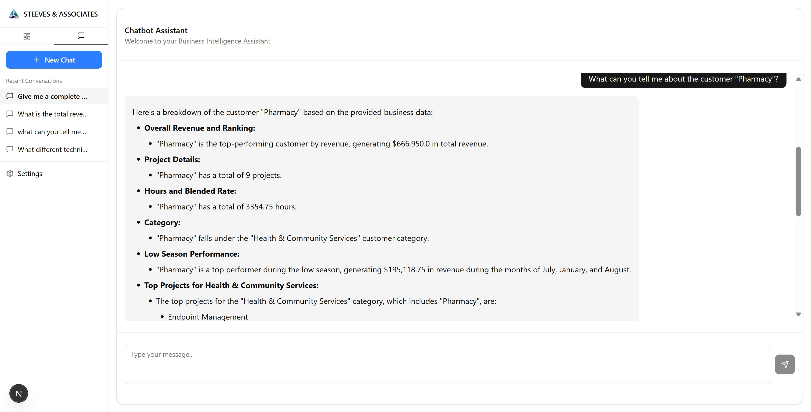

# Steeves & Associates - Business Intelligence Dashboard

Welcome to the Steeves & Associates Business Intelligence (BI) Dashboard. This powerful tool provides deep insights into your business operations, featuring advanced analytics, forecasting, and an intelligent chatbot to answer your questions in plain English.


_The main dashboard provides a high-level overview of key business metrics and revenue forecasts._


_The AI-powered chatbot allows for natural language queries into your business data._

> **Note:** For a detailed visual tour of all dashboard pages and their features, please see the [Dashboard Documentation](Dashboard_Documentation.md).

This document provides a high-level overview of the project and guides you through the setup, operation, and customization of the dashboard.

## Table of Contents

-   [What is this?](#what-is-this)
-   [Project Structure](#project-structure)
-   [Setup Instructions](#setup-instructions)
    -   [Prerequisites](#prerequisites)
    -   [PostgreSQL Setup](#postgresql-setup)
    -   [Backend API Setup](#backend-api-setup)
    -   [Frontend Dashboard Setup](#frontend-dashboard-setup)
-   [Running the Dashboard](#running-the-dashboard)
-   [Customizing the Dashboard](#customizing-the-dashboard)
    -   [Using a Different Dataset](#using-a-different-dataset)
    -   [Updating the Chatbot's Knowledge](#updating-the-chatbots-knowledge)
    -   [Updating the High-Level Summary](#updating-the-high-level-summary)

## What is this?

This BI Dashboard is a comprehensive analytics platform designed to help Steeves & Associates visualize performance, identify trends, and make data-driven decisions. It includes:

-   **Interactive Dashboards:** Multiple pages of analytics covering seasonal trends, growth drivers, project performance, and resource efficiency.
-   **AI-Powered Chatbot:** A conversational AI that can answer complex questions about your data. It understands context and can provide detailed explanations, summaries, and insights on demand.
-   **Advanced Forecasting:** Time-series forecasting models to predict future revenue and identify potential opportunities or risks.
-   **Secure and Scalable:** Built with a robust backend and a modern frontend, ensuring the platform is both secure and ready to grow with your business.

## Project Structure

This project contains two main applications: a Next.js frontend and a Flask backend.

-   **Root Directory (`/`)**: Contains the frontend application. All `npm` commands should be run here.
-   **`dashboard-api/`**: Contains the backend server that powers the dashboard. All Python-related commands are run here.
-   **`scripts/`**: Contains helper scripts, most importantly the database migration script.

## Setup Instructions

This project comes with a pre-built dataset (`output_file_1.csv`) and a ready-to-use knowledge base for the chatbot (`bi_rag_storage`). The following steps will get the dashboard running with this included data.

### Prerequisites

-   **Node.js:** Required for the frontend dashboard.
-   **Python:** Required for the backend API.
-   **PostgreSQL:** The database used to store and manage the project data.

### PostgreSQL Setup

This project requires a running PostgreSQL database.

1.  **Download and Install:** Visit the official [PostgreSQL website](https://www.postgresql.org/download/) and download the installer for your operating system. The standard installers for Windows and macOS are easy to follow.
2.  **Initial Setup:** During installation, you will be prompted to set a password for the default `postgres` superuser. Remember this password.
3.  **Create a Database and User:** After installation, you will need a dedicated database and user for this project. You can do this using a tool like `psql` (the command-line terminal) or a graphical tool like [pgAdmin](https://www.pgadmin.org/) (which often comes with the installer). The database name, username, and password you create **must match** the values you set in the `dashboard-api/.env` file.

### Backend API Setup

The backend server requires a Python environment and a connection to a PostgreSQL database.

1.  **Navigate to the API directory:**
    ```bash
    cd dashboard-api
    ```

2.  **Create a Python Virtual Environment:**
    This keeps the project's Python packages isolated.
    ```bash
    python -m venv venv
    source venv/bin/activate  # On Windows, use `venv\Scripts\activate`
    ```

3.  **Install Dependencies:**
    ```bash
    pip install -r requirements.txt
    ```

4.  **Configure Environment Variables:**
    -   In the `dashboard-api` directory, copy the `.env.example` file to a new file named `.env`.
    -   Open the `.env` file and fill in the placeholder values for your PostgreSQL database and your API keys for Google Gemini and Mistral.

5.  **Database Setup:**
    -   Ensure your PostgreSQL server is running.
    -   From the `dashboard-api` directory, run the migration script to set up the database:
    ```bash
    python ../scripts/migrate_to_sql_flask.py
    ```

### Frontend Dashboard Setup

All frontend commands should be run from the project's root directory.

1.  **Install Dependencies:**
    ```bash
    npm install
    ```

## Running the Dashboard

To run the dashboard, you need to start both the backend and frontend servers. Each will run in its own terminal window.

1.  **Start the Backend API:**
    -   Open a terminal and navigate to the `dashboard-api` directory.
    -   Activate the virtual environment:
    ```bash
    source venv/bin/activate  # On Windows, use `venv\Scripts\activate`
    ```
    -   Run the Flask application:
    ```bash
    python app.py
    ```
    The API will now be running at `http://localhost:5000`.

2.  **Start the Frontend Dashboard:**
    -   Open a **new** terminal at the project root.
    -   Run the Next.js development server:
    ```bash
    npm run dev
    ```
    The dashboard will now be accessible in your web browser at `http://localhost:3000`.

## Customizing the Dashboard

### Using a Different Dataset

You can power the dashboard with your own data by providing a custom CSV file.

1.  **Prepare your CSV file.** It must contain the following columns:
    -   `Customer Name`
    -   `Project`
    -   `Worked Date`
    -   `Task or Ticket Title`
    -   `Resource Name`
    -   `Billable Hours`
    -   `Hourly Billing Rate`
    -   `Extended Price` (This is the revenue column)
    -   `Detailed Customer Category`

2.  **Replace the existing data file.** Save your file as `output_file_1.csv` inside the `dashboard-api/` directory, replacing the existing one.

3.  **Re-run the database migration.** This will clear the old data and load your new dataset. From the `dashboard-api` directory:
    ```bash
    python ../scripts/migrate_to_sql_flask.py
    ```

### Updating the Chatbot's Knowledge

The chatbot's knowledge comes from two sources: the structured data in the PostgreSQL database and an unstructured knowledge base (`bi_rag_storage`). The knowledge base gives the chatbot deeper context on specific topics.

#### Option 1: Add Knowledge from Web Pages (Default)

The ingestion script is configured by default to add knowledge from web pages.

1.  **Create a list of URLs.** In the `dashboard-api` directory, create a file named `pages.txt` and add the URLs you want to scrape, with one URL per line.

2.  **Run the ingestion script.** From the `dashboard-api` directory, run this command to scrape the URLs and integrate the content into the `bi_rag_storage` knowledge base.
    ```bash
    python ingest_data.py
    ```
    The chatbot will now be able to use information from those web pages to answer questions.

#### Option 2: Add Knowledge from Local Files (Advanced)

To build the chatbot's knowledge from your own local documents (like PDFs or text files), you can modify the `ingest_data.py` script.

1.  **Install a PDF reader library:** From the `dashboard-api` directory, run:
    ```bash
    pip install pypdf
    ```

2.  **Modify `ingest_data.py`:** Replace the entire contents of the script with the following code. This version replaces the web crawler with a function that reads files from a `docs` directory.

    ```python
    import asyncio
    import os
    from lightrag import LightRAG
    from rag_config import mistral_llm_func, gemini_embedding_wrapper
    from lightrag.kg.shared_storage import initialize_pipeline_status
    import pypdf # Required for reading PDF files

    WORKING_DIR = "./bi_rag_storage"
    DOCS_DIR = "./docs" # Directory to read local files from

    def load_docs_from_directory(directory_path):
        """Loads content from .txt and .pdf files in a specified directory."""
        documents = []
        if not os.path.exists(directory_path):
            print(f"❌ Directory not found: {directory_path}")
            os.makedirs(directory_path)
            print(f"✅ Created directory: {directory_path}. Please add your documents here.")
            return documents

        for filename in os.listdir(directory_path):
            file_path = os.path.join(directory_path, filename)
            doc_id = file_path # Use file path as the document ID
            text = ""
            try:
                if filename.endswith(".pdf"):
                    print(f"📖 Reading PDF: {filename}")
                    reader = pypdf.PdfReader(file_path)
                    for page in reader.pages:
                        text += page.extract_text()
                elif filename.endswith(".txt"):
                    print(f"📖 Reading TXT: {filename}")
                    with open(file_path, 'r', encoding='utf-8') as f:
                        text = f.read()
                else:
                    # Skip other file types
                    continue

                if text.strip():
                    documents.append({"text": text, "id": doc_id})
            except Exception as e:
                print(f"⚠️ Error reading {filename}: {e}")

        print(f"✅ Loaded {len(documents)} documents from {directory_path}")
        return documents

    async def main():
        print("🚀 Starting data ingestion process from local directory...")

        # 1. Load documents from the local 'docs' directory
        documents_to_insert = load_docs_from_directory(DOCS_DIR)

        if not documents_to_insert:
            print("❌ No documents found to process. Exiting.")
            return

        # 2. Initialize LightRAG
        print("\n⚙️ Initializing LightRAG system...")
        rag = LightRAG(
            working_dir=WORKING_DIR,
            embedding_func=gemini_embedding_wrapper,
            llm_model_func=mistral_llm_func,
            llm_model_max_async=5,
        )
        await rag.initialize_storages()
        await initialize_pipeline_status()
        print("✅ LightRAG storage initialized.")

        # 3. Insert all documents
        print(f"\n⚙️ Starting document insertion process...")
        texts = [doc["text"] for doc in documents_to_insert]
        ids = [doc["id"] for doc in documents_to_insert]

        print("🔄 Adding documents to processing queue...")
        await rag.ainsert(texts, ids=ids)

        print("🔄 Processing the document queue (knowledge graph extraction)...")
        await rag.apipeline_process_enqueue_documents()
        print("✅ All documents processed and knowledge graph updated!")

        print("\n🔄 Finalizing storage...")
        await rag.finalize_storages()
        print("🎉 Data ingestion complete! Knowledge base is ready for queries.")

    if __name__ == "__main__":
        asyncio.run(main())
    ```

3.  **Run the script:** Place your `.pdf` or `.txt` files into the `dashboard-api/docs/` directory and run the script from within `dashboard-api/`:
    ```bash
    python ingest_data.py
    ```

### Updating the High-Level Summary

The chatbot uses a high-level JSON summary (`dataset_summary.json`) for quick, general questions. This file is generated from the data in the database.

If you have updated the database with new data, you should regenerate this summary file. From the `dashboard-api` directory:
```bash
python generate_summary.py
```
This ensures the chatbot's high-level understanding remains consistent with the underlying data.

## Troubleshooting

Here are a few common issues you might encounter during setup:

-   **Database Connection Errors:**
    -   **"Authentication failed" or "password authentication failed"**: Double-check that the `DB_USER`, `DB_PASSWORD`, `DB_HOST`, and `DB_PORT` in your `dashboard-api/.env` file exactly match the credentials for your PostgreSQL user and server.
    -   **"Database does not exist"**: Make sure you have created the database in PostgreSQL and that its name matches the `DB_NAME` in your `.env` file.
    -   **"Connection refused"**: Ensure your PostgreSQL server is running and accessible. Check firewall rules if your database is on a different machine.

-   **API Key Errors:**
    -   If the chatbot isn't responding or you see errors related to `GEMINI_API_KEY` or `MISTRAL_API_KEY`, ensure you have correctly copied the keys into your `dashboard-api/.env` file. Verify there are no extra spaces or characters.

-   **`npm install` Fails:**
    -   If you see errors related to package downloads, check your internet connection.
    -   If you have an older version of Node.js, you might encounter issues. Ensure you are using a recent LTS (Long-Term Support) version.

-   **`pip install` Fails:**
    -   Make sure your Python virtual environment is activated before running `pip install -r requirements.txt`. You should see `(venv)` at the start of your terminal prompt.
    -   Some packages might require build tools. If you see errors about missing C compilers, you may need to install the build essentials (on Linux) or Command Line Tools for Xcode (on macOS). 